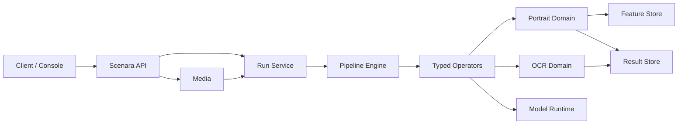

# Scenara 景析

Scenara 是面向企业私有化部署的统一视觉解析平台。平台以版本化 Media、Run、Pipeline 和 Result 契约接收图片、视频、PDF 与实时流，并通过可安装的 Domain 提供强类型视觉能力。

当前产品阶段：`0.1.0-dev`

- 正式领域：Portrait（迁移中）
- 验证领域：OCR / Document
- 正式部署基线：Ubuntu x86_64、Docker Compose、NVIDIA GPU、PostgreSQL/pgvector、Redis、S3/MinIO
- 开发模式：本地对象存储、进程内状态与显式标记的开发适配器

> Scenara 尚未发布 1.0。缺少合法模型制品、固定评估集、目标 GPU 容量报告或恢复证据时，不得宣称对应能力可用于正式生产。

## 架构



依赖规则：`platform` 不导入具体 Domain；Domain 只实现平台契约；`infrastructure` 只实现平台端口；可选 Enterprise Module 通过 Policy Hook 接入。

## 本地启动

```powershell
python -m pip install -r requirements.txt -r requirements/dev.txt
python -m uvicorn scenara.server:app --host 127.0.0.1 --port 8000
```

健康检查：`GET /healthz`。新公共契约统一位于 `/api/v1`，旧 Portrait Hub `/v1` 契约不属于 Scenara。

## 仓库边界

`app/` 是从 Portrait Hub 筛选导入的迁移适配层，只能被 `scenara.domains.portrait` 使用。新平台能力必须进入 `scenara/`，不得继续向 `app/portrait_*` 增加通用平台职责。

来源与筛选规则见 [PROVENANCE.md](PROVENANCE.md)，品牌规范见 [docs/brand/BRAND.md](docs/brand/BRAND.md)，模型资产政策见 [MODEL_ASSETS.md](MODEL_ASSETS.md)。

## 授权

源码公开不代表开源授权。除第三方组件另有声明外，本仓库使用 [Scenara Proprietary Source License](LICENSE)。
