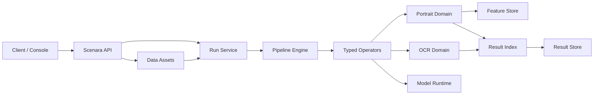

# Scenara 景枢

Scenara 是面向企业私有化部署的视觉 AI 中枢平台。平台以版本化数据资产、Run、Pipeline 和 Result 契约接收图片、视频、PDF 与实时流，并通过可安装的 Domain 提供强类型视觉能力。当前版本已把同一人的视频内连续出现、跨视频/跨摄像头长期轨迹、人工确认与长期身份查询串成闭环。

当前产品阶段：`0.3.0-dev.43`（Python 包版本为 `0.3.0.dev43`）

- 正式领域：Portrait（迁移中）
- 验证领域：OCR / Document
- 正式部署基线：Ubuntu x86_64、Docker Compose、NVIDIA GPU、PostgreSQL/pgvector、Redis、经认证的 S3 Provider（当前基线为 MinIO）
- 开发模式：本地对象存储、进程内状态与显式标记的开发适配器

> Scenara 尚未发布 1.0。缺少合法模型制品、固定评估集、目标 GPU 容量报告或恢复证据时，不得宣称对应能力可用于正式生产。

## 产品矩阵与访问底座

Scenara 作为平台母品牌，统一规划 Parse、Model、Data、Edge、Flow、Search、Agent、Console、API、SDK 与 Index。当前并非 11 套独立系统：Console、API 和 SDK 是共享入口，Index 是共享底座，产品模块继续复用同一平台内核、IAM、授权、审计和部署栈。

当前版本已提供产品目录、仓库拓扑、正式跨仓库契约、Organization、Project、User、Role、Membership、Service Account、API Key 与 Product Entitlement，并支持平台根令牌、按项目绑定的服务账号 API Key 以及用户名密码登录。`0.3.0-dev.43` 将媒体直传统一为受限流式上传，默认限制为 512 MiB；大文件经带 SHA-256 核验的预签名对象存储上传进入平台。该版本还隔离了 batch/stream GPU、配置化 PostgreSQL 连接池、公开 Redis 队列 lag/pending 指标、加固 Qdrant 特征空间契约并完善控制台解析和凭据交互。完整升级影响见 [0.3.0-dev.43 发布说明](docs/release/0.3.0-dev.43发布说明.md)。Core 已通过版本化 Data 客户端接入 Dataset、Version、Annotation 和 Hard Sample 的独立服务边界；完整切流步骤见 [Data 切流操作说明](docs/strategy/数据平台切流操作说明.md)。完整成熟度、依赖顺序与非目标见 [产品矩阵](docs/strategy/产品矩阵.md)，当前仓库与独立 Model/Data 仓库的分工见 [仓库拓扑](docs/strategy/仓库拓扑.md)，五条可发布契约见 [契约包](contracts/repository/README.md)，认证和授权边界见 [访问底座](docs/strategy/访问底座.md)，人像 AI 长期演进方向见 [人像智能基础平台战略](docs/strategy/人像智能基础平台战略.md)。

解析控制台采用“解析 -> 领域”的工作区结构，人像和 OCR 文档分别进入独立领域页面；图片、视频、文档和视频流是页面内部的数据类型标签，例如 `parse/portrait/image` 与 `parse/ocr/document` 仍可作为深链路访问。每个领域工作区内完成上传、参数配置、运行进度、当前结果查看与历史恢复；“数据资产”和“运行”页面分别承担文件/视频流来源管理与运行生命周期管理，新增的“解析结果”页面负责跨领域、跨任务浏览和筛选结果。领域菜单由后端 `DomainManifest` 驱动，新领域接入时不需要重新拆分前端解析流程。



依赖规则：`platform` 不导入具体 Domain；Domain 只实现平台契约；`infrastructure` 只实现平台端口；部署采用本地策略、项目隔离和可撤销 API Key，不依赖公司商业运营模块。

## 本地启动

```powershell
python -m pip install -r requirements/dev.txt
python start.py
```

`start.py` 是本地开发一键启动器：缺少 `.env` 时从 `.env.example` 创建，准备 `runtime-state/`，再使用当前 Python 解释器启动 API。新创建的 `.env` 默认使用内存状态、内联队列和本地对象存储，不需要额外启动 PostgreSQL、Redis 或 MinIO；已有 `.env` 会按其中配置启动，不会被覆盖。已有 `.env` 使用本机 Redis 且端口尚未监听时，启动器会自动查找 `runtime-state/redis-*` 中的 Redis 并随 API 启停，同时自动启动 batch/stream 两个 Run worker。

如果现有 `.env` 配置了 PostgreSQL、Redis 或 S3，但本机暂时没有这些服务，可以使用 `python start.py --local` 临时覆盖为内存、本地对象存储和内联队列；该选项不会修改 `.env`。

需要同时运行 Console Vite 开发服务器时，在仓库根目录执行：

```powershell
python start.py --with-console --reload
```

API 默认位于 `http://127.0.0.1:8000`，Console 开发服务器位于 `http://127.0.0.1:5173/console/`；不带 `--with-console` 时，已构建的 Console 仍可从 API 的 `/console/` 路径访问。按 `Ctrl+C` 会同时停止 API、Console 和本地 worker 子进程。使用 `python start.py --help` 查看环境文件、端口和自动重载选项。

本地运行时的持久化状态和 rollout 审计默认写入 `runtime-state/`，可保留的日志文件放在
`runtime-state/logs/`；生产部署继续将应用日志输出到 stdout，由容器运行时统一采集。

`.env.example` 已按运行模式、认证、资源限制、模型与加密、网络安全、数据保留、运行产物和生产后端分组提供中文说明。本地首次登录需同时设置 `SCENARA_BOOTSTRAP_ADMIN_USERNAME` 与 `SCENARA_BOOTSTRAP_ADMIN_PASSWORD`，密码长度不得少于 12 个字符；真实 `.env` 已被 Git 忽略，不得提交密码、根令牌或加密密钥。

前端构建完成后，服务会在 `http://127.0.0.1:8000/console/` 提供同版本中文控制台；根路径会自动跳转到该地址。

存活探针：`GET /livez`；依赖就绪探针：`GET /readyz`；兼容探针：`GET /healthz`。经接口认证的 Prometheus 指标位于 `GET /metrics`。新公共契约统一位于 `/api/v1`，旧 Portrait Hub `/v1` 契约不属于 Scenara。

生产镜像和离线轮子只使用带 SHA-256 的 `requirements/production.lock`。修改 `requirements.txt` 或 `requirements/prod-optional.txt` 后，运行 `uv pip compile requirements/production.in --python-version 3.12 --python-platform x86_64-manylinux_2_28 --generate-hashes --no-emit-index-url --output-file requirements/production.lock` 并提交锁文件。领域推理运行时不进入这份锁文件：PaddleOCR 及其 PaddlePaddle GPU 运行时见 `requirements/ocr-optional.txt`，PaddleVideo、PyTorch 与 PDF 原生文本提取见 `requirements/domain-optional.txt`，按部署的 CUDA 版本单独安装。

## 仓库边界

本仓库是 Scenara 平台集成仓库，不单独改名为 Scenara Parse。Scenara Parse、Console、API、SDK 及共享平台底座在此统一演进；已有模型训练仓库独立承担 Scenara Model 的训练生产，Data 的领域服务独立部署。模型准入、发布、部署、回滚以及业务反馈与难例导出仍由本仓库治理，跨仓库禁止共享数据库和源码导入。Dataset、Dataset Version 与 Annotation 的公共路径由 Core 网关通过 `DataPlatformClient` 转发给独立的 `scenara-data` 服务；本地适配器仅用于开发和迁移验证，生产环境必须配置远程 Data 服务。切流和迁移操作见 [Data 平台切流说明](docs/strategy/数据平台切流操作说明.md)。

模型闭环从 `POST /api/v1/model-packages/admissions` 接收带不可变 SHA-256 引用的正式清单，经证据验证进入发布状态机。激活或回滚按租户、项目和能力切换唯一运行时绑定；每个 Run 在开始时冻结该绑定并写入结果来源。部署状态变化同时持久化为 `ModelDeploymentEvent`，并通过 `model.deployment.changed` Webhook 投递回训练仓库。契约目录由 `GET /api/v1/platform/contracts` 暴露。

`app/` 是从 Portrait Hub 筛选导入的迁移适配层，只能被 `scenara.domains.portrait` 使用。新平台能力必须进入 `scenara/`，不得继续向 `app/portrait_*` 增加通用平台职责。

来源与筛选规则见 [源码溯源说明.md](源码溯源说明.md)，品牌规范见 [docs/brand/品牌规范.md](docs/brand/品牌规范.md)，模型资产政策见 [模型资产政策.md](模型资产政策.md)，升级、回滚、探针和告警见 [deploy/运维基线.md](deploy/运维基线.md)，版本变更见 [更新日志.md](更新日志.md)。

## 授权

本仓库采用 [MIT License](LICENSE)，允许个人或组织使用、修改和部署；第三方组件、模型权利、数据集和媒体资产仍受其各自许可及适用法律约束。
默认 Compose 部署为个人模式，不要求企业许可证。企业签名许可证校验代码保留在 `scenara.enterprise`，通过 `deploy/compose.enterprise.yml` 显式叠加后才启用。
当前发布基线：`0.3.0-dev.43`（Python 包为 `0.3.0.dev43`）。

对象存储在平台边界保持对提供商中立。MinIO 为私有化部署基线；经认证的兼容 S3 的替代方案以及校验和、不可变性、生命周期、TLS、凭据和直传资质契约详见 [docs/对象存储提供商认证.md](docs/对象存储提供商认证.md)。
