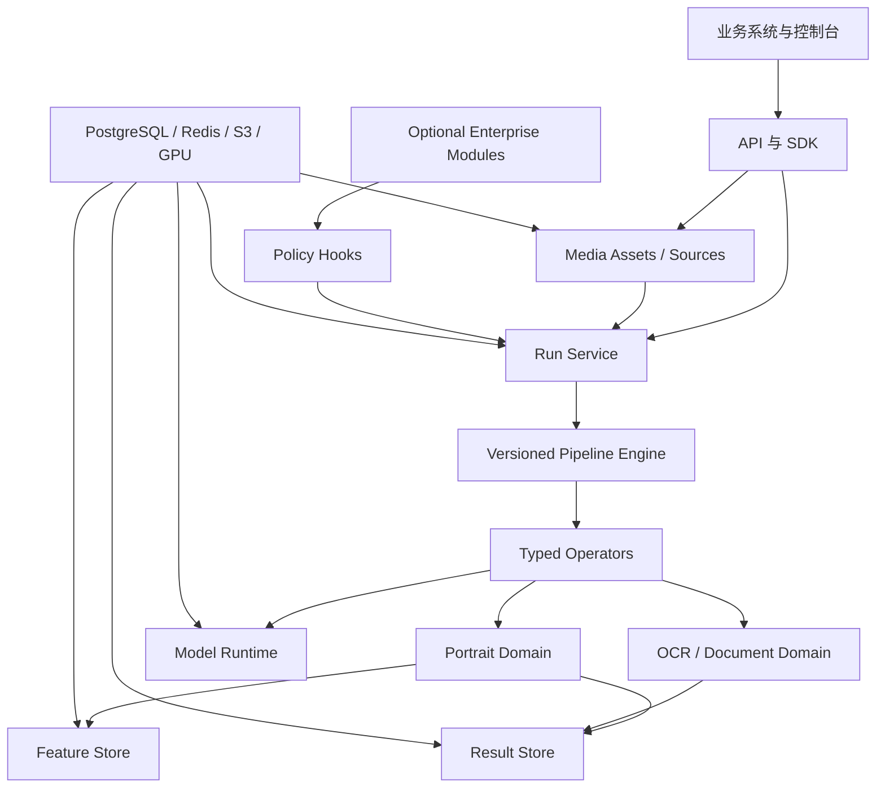

# Scenara 景析全面优化升级方案

## 1. 产品与仓库战略

- 正式品牌为 **Scenara 景析**，产品类别为“企业统一视觉解析平台”，不再使用 Portrait Hub 或 Vision Hub。
- Scenara 面向图片、视频、PDF 和实时流，提供媒体接入、Pipeline 执行、模型运行、结果管理、特征检索和企业治理。
- Portrait 是首个正式领域，OCR/Document 是第二领域；未完成真实接入前不宣传 Vehicle、Industrial、Medical 等能力。
- 新建公开仓库 `jeja2023/scenara`，使用筛选后的 Portrait Hub 稳定快照创建全新根提交，不复制旧 Git 历史。
- 根提交记录来源仓库、来源 SHA、导入清单、排除清单和知识产权声明；不导入旧发布记录、生成代码、运行数据、`.env`、模型权重和过期规划。
- `portrait-hub` 在迁移期只接受阻断性修复；Scenara 完成能力对照后，为旧仓库打最终标签、生成全 refs `git bundle` 和 SHA-256 清单，再设置 GitHub Archive。
- Scenara 源码公开但采用专有授权；首次推送前必须补齐 `LICENSE`、版权声明、第三方通知、模型资产政策和安全报告渠道。
- Python SDK 使用 `scenara-sdk` / `scenara_sdk`，TypeScript SDK 使用 `scenara-sdk`，镜像和配置统一为 `scenara-*` 与 `SCENARA_*`。

## 2. 品牌与 Logo

- Logo 使用独立图形标志，不从“景析”汉字笔画中强行造图。
- 主图形由抽象字母 `S`、两个相向取景框角和逐渐规则化的方块组成，表达“场景输入 → 解析 → 结构化输出”。
- 避免人脸轮廓、眼睛、镜头光圈、机器人和复杂神经网络节点等常见 AI 图形。
- 主色采用石墨黑与清晰青绿，珊瑚色只作为识别点和状态强调；不使用渐变，必须支持单色、反白和小尺寸显示。
- 交付物包含 SVG 主标、横版/竖版中英文字标、favicon、应用图标、单色版、深浅背景版、安全留白和最小尺寸规范。
- 产品展示统一使用“Scenara 景析”；技术界面可只显示 Scenara，中文副标题使用“统一视觉解析平台”。

## 3. 目标架构与接口

- 代码按 `platform`、`domains`、`enterprise`、`infrastructure` 划分；Platform 不导入具体 Domain，Infrastructure 只实现 Platform 定义的端口。
- 保持模块化单体与独立 Worker：API/控制面、批处理 GPU Worker、实时流 Worker和治理 Scheduler 共用契约与注册表。
- PostgreSQL 是媒体、Run、Pipeline、模型、结果和审计的唯一事实源；Redis 只负责任务投递、租约和短期事件。
- S3/MinIO 保存原始媒体、缩略图、完整结果文档和派生制品；PostgreSQL 保存状态、摘要、索引、校验和及对象引用。
- `DomainPlugin` 注册领域 manifest、Operator、Pipeline、结果 schema 和控制台路由；插件在构建期安装，不允许通过 API 上传执行代码。
- Pipeline 使用不可变语义版本，生命周期为 `draft → validated → approved → active → retired`；调用方只能选择已激活版本并覆盖白名单参数。
- Operator 必须声明强类型输入输出、超时、资源预算、批处理能力和失败策略；DAG 必须无环、端口兼容且 fan-out 有界。
- Model Adapter 统一 `load`、`predict`、`health`、`metadata`、`close`；模型包必须包含摘要、来源、许可证、模型卡、显存预算和回归样例。
- 正式环境禁止 fallback、placeholder 和静默 CPU 回退；开发替代能力必须在结果和控制台中明确标记。

### 公共 API

| 资源 | 主要接口 | 语义 |
|---|---|---|
| Media Asset | `/api/v1/media/assets` | 上传图片、视频、PDF或登记 S3 对象 |
| Media Source | `/api/v1/media/sources` | 登记并安全保存 RTSP/RTMP/HTTP(S) 流 |
| Run | `/api/v1/runs` | 创建、查询、分页和筛选 Pipeline 执行 |
| Lifecycle | `/runs/{id}/cancel|pause|resume` | 受 Pipeline 能力约束的状态操作 |
| Result | `/runs/{id}/result` | 分页读取媒体单元、对象和领域结果 |
| Events | `/runs/{id}/events` | 可续传 SSE 进度与结果事件 |
| Image Shortcut | `/api/v1/parse/image` | 原子创建临时 Media + Run，并限时等待结果 |
| Portrait | `/api/v1/portrait/identities|enrollments|search|compare` | 人像领域专用业务资源 |

- Run 状态固定为 `queued/running/pausing/paused/completed/failed/cancelling/cancelled`，使用乐观并发版本和 `Idempotency-Key`。
- 图片可同步等待；PDF、视频、批量和流始终异步。实时流正常停止时进入 `completed` 并记录 `termination_reason`。
- 事件采用至少一次投递和单调 `event_id`；消费者必须去重。外部通知使用签名 Webhook，轮询始终保留。
- 统一结果包含版本、Run、Media、Pipeline、模型、媒体单元、对象、关系、制品、耗时、警告和来源证明。
- `domain_payload` 使用带 discriminator 的 Portrait/OCR 强类型联合模型，不使用无约束万能 JSON 代替领域契约。
- Feature Store 使用 `feature_space` 隔离领域、模态、模型版本、维度、距离度量和阈值，禁止跨空间比较向量。
- 原始媒体默认保留 7 天、预览 30 天、结构化结果 180 天；正式入库生物特征保留至身份删除，并允许项目配置更短周期。

## 4. 实施路线

1. **Scenara 0.1 仓库基线**：完成品牌、授权、来源清单、目录边界、ADR、OpenAPI、数据库初始 revision、CI 和生产 Compose。
2. **Scenara 0.2 双领域垂直链路**：用 Portrait 人体检测和 OCR 检测/识别同时验证 Media、Run、Operator、Pipeline 和 Result，防止平台内核被人像语义绑死。
3. **Scenara 0.3 平台内核**：完成图片、视频、PDF、流、统一调度、检查点、SSE、Webhook、Feature Store、留存和结果分片。
4. **Scenara 0.4 Portrait Domain**：完成人体检测/ReID、人脸检测/对齐/特征、姿态、人体解析/衣着属性、轮廓分割、步态和质量感知融合。
5. **Scenara 0.5 OCR/Document Domain**：完成文字检测、识别、阅读顺序和标题、段落、图片、表格区域等基础版面结果。
6. **Scenara 0.6 Enterprise Modules**：迁移授权、权益、配额、计量、SLA、事故、支持与合规证据，通过 Policy Provider 接入，核心平台不反向依赖。
7. **Scenara 0.7 控制台与 SDK**：重构为总览、媒体、运行、结果、Portrait、OCR、Pipeline、模型、接入、运维和可选企业模块；交付稳定 Python SDK 和 OpenAPI 生成的 TypeScript SDK。
8. **Scenara 1.0 私有化发布**：正式支持 Ubuntu x86_64、Docker Compose、单卡 24GB NVIDIA、PostgreSQL/pgvector、Redis 和 S3/MinIO；Kubernetes、Qdrant 和多节点 HA 暂列实验支持。

## 5. 验收与发布门槛

- 建立 Portrait Hub 能力矩阵，逐项标记“已迁移、重新实现、明确废弃”，不以 API 路径兼容代替能力验收。
- 架构测试自动禁止 Platform 导入具体 Domain，并检查 Domain 只能通过注册表和公共契约接入。
- 契约测试固定 OpenAPI、错误结构、Run 状态机、Pipeline schema、结果联合类型和 Python/TypeScript SDK。
- 真实 PostgreSQL/pgvector、Redis、MinIO 集成测试覆盖幂等、重试、暂停恢复、取消、Worker 重启、流重连和对象删除。
- 安全测试覆盖 SSRF、恶意图片/PDF、解压炸弹、越权访问、凭证脱敏、embedding 权限、审计失败关闭和生物信息删除。
- Portrait 与 OCR 必须建立合法、脱敏、版本化的固定评估集；任何准确率、召回率或误识率承诺必须来自签署报告。
- Portrait 验收覆盖图片、长视频、实时流、跨摄像头 ReID、人脸检索、轨迹稳定性和多模态融合；步态只接受有效视频序列。
- OCR 验收覆盖中文文档、旋转、复杂背景、多页 PDF、阅读顺序和基础版面；接入过程中不得在 Platform 增加 OCR 专用分支。
- 单卡 24GB 目标机执行持续负载、突发流量、显存压力、背压和故障恢复测试，形成可复核容量与恢复报告。
- 公开仓库门禁包含秘密扫描、依赖许可证清单、SBOM、模型资产检查、专有授权文本、来源证明和安全策略。
- Scenara 1.0 只有在完整 Portrait、OCR 检测/识别/版面、离线安装、备份恢复、安全审计、模型权属、质量证据和容量证据全部通过后发布。
- 以上方案不考虑旧 API、SDK、数据库和开发数据兼容；开发数据全部重建，原仓库承担历史追溯与回退参考。
