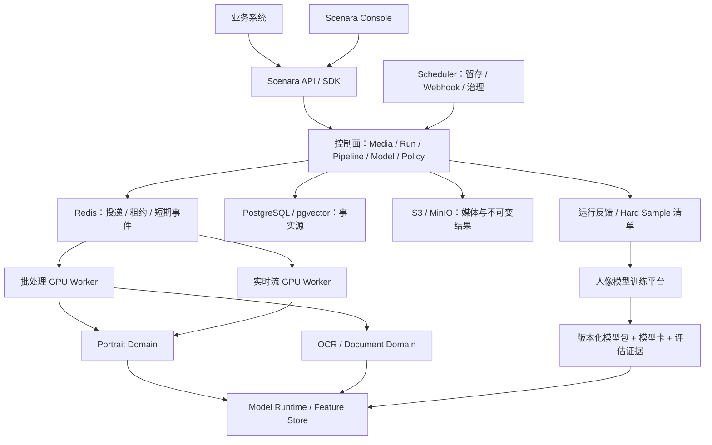

# Scenara（景枢）企业级视觉 AI 平台优化升级方案

**版本：V2.7（0.3.0-dev.5 工程质量与容量基线版）**

**基线日期：2026-07-31**

**适用范围：当前 `scenara` 仓库、私有化部署产品与人像模型训练平台的协作边界**

> 本版不再把远期愿景写成当前能力。方案以仓库现状、已接受 ADR、自动化测试和 1.0 发布门禁为依据，先完成可交付、可验证的 Scenara 1.0，再扩展数据闭环和多领域能力。

## 1. 执行结论

1. **品牌决策已确定**：英文品牌保持 **Scenara**，中文品牌由“景析”正式变更为 **景枢**，完整名称统一为 **Scenara 景枢**，产品类别为“视觉 AI 中枢平台”。“景枢”表达统一接入、解析、调度、输出和治理的视觉能力中枢；不再保留两套中文品牌，也不恢复 Portrait Hub 或 Vision Hub。
2. **建立统一产品矩阵，但不复制平台**：Parse、Model、Data、Edge、Flow、Search 与 Agent 是可独立演进的产品模块；Console、API、SDK 是共享入口，Index 是共享底座。当前继续使用同一平台内核、IAM、授权、审计和部署栈，不因命名拆分重复系统。
3. **先完成 1.0 资格验证，再扩功能**：仓库中 0.4-1.0 的主体代码已经存在，主要缺口不是继续堆功能，而是真实 PostgreSQL/Redis/MinIO、合法模型、目标 GPU、离线安装和备份恢复证据。
4. **Portrait 是首个正式领域，OCR/Document 是验证领域**：二者用于证明平台内核可复用。Vehicle、Industrial、Behavior 等新领域只有在现有领域通过质量和商业验证后才立项。
5. **训练平台与 Scenara 解耦协作**：训练平台负责数据集、标注、实验和训练；Scenara 负责模型包准入、部署、推理、评估证据、运行反馈和版本追溯。双方通过版本化制品与事件契约连接，不共享内部数据库。
6. **产品宣传必须分级**：只有“实现完成 + 资格验证完成 + 证据签署”后，能力才能标记为生产可用。当前开发替代实现、未授权权重和未签署评估结果不得进入对外能力清单。

## 2. 项目实际基线

### 2.1 代码与产品状态

| 维度 | 当前事实 | 结论 |
|---|---|---|
| 品牌现状 | `README.md`、品牌规范、控制台、OpenAPI、SDK 文档和品牌资产已统一为“景枢” | 品牌迁移已完成；仓库门禁阻止旧品牌重新进入当前产品表面 |
| 产品阶段 | 当前版本为 `0.3.0-dev.5`，仓库明确声明尚未发布 1.0（`README.md`） | 所有生产级宣传均受发布门禁约束 |
| 产品与访问底座 | 11 项产品目录、Organization、Project、User、Role、Membership、Service Account、API Key 与 Product Entitlement 已成为公共契约 | 产品继续共享 IAM、授权、审计和部署栈；身份联邦与商业生命周期仍受门禁约束 |
| 架构边界 | `platform` 定义契约，`domains` 实现领域，`infrastructure` 实现端口，`enterprise` 通过 Policy Hook 接入（`docs/adr/0001-platform-domain-boundaries.md:14-29`） | 继续采用模块化单体，不拆微服务平台 |
| 正式领域 | Portrait 为正式领域；OCR/Document 为验证领域（`README.md:7-8`） | 2026 年不同时扩张多个新领域 |
| 媒体范围 | Media/Run/Pipeline/Result 契约已覆盖图片、视频、PDF 和实时流（`README.md:3`） | 以统一媒体与运行契约对外，不为每种媒体另建 API 体系 |
| 执行内核 | 已有类型化 Operator、版本化 Pipeline、白名单参数、超时/重试和 DAG 校验（`scenara/platform/pipeline.py`） | 近期补齐资格验证和可观测性，不重写编排引擎 |
| 数据权威 | PostgreSQL 为事实源；Redis 只保存投递、租约和短期事件；S3 保存媒体和不可变结果（`docs/adr/0001-platform-domain-boundaries.md:27-29`） | 禁止把 Redis 当业务数据库，禁止在多处保存不一致状态 |
| 运行语义 | 至少一次投递、乐观并发、单调事件 ID、不可变结果对象（`docs/adr/0002-runtime-and-storage.md:12-19`） | 重点验证幂等、重试和恢复，不改为“恰好一次”口号 |
| 控制台 | 已有总览、媒体、运行、结果、人像、OCR、Pipeline、模型、接入、运维和企业模块路由（`frontend/console/src/router.ts`） | 先打通完整操作闭环，再考虑可视化拖拽编排 |
| SDK | Python SDK 与 OpenAPI 生成的 TypeScript SDK 已纳入实现门禁 | 后续必须保持 OpenAPI 与 SDK 零漂移 |
| 部署基线 | Ubuntu x86_64、Docker Compose、单卡不少于 23,000 MiB 的 NVIDIA GPU、PostgreSQL/pgvector、Redis、MinIO（`deploy/README.md`） | Kubernetes、多节点 HA 和外部向量库不进入 1.0 承诺 |

### 2.2 当前实现成熟度

| 阶段 | 当前状态 | 仍缺的关键证据 |
|---|---|---|
| 0.1 仓库与架构基线 | 工程完成，软件许可证法务批准待完成 | 持续通过仓库、契约与 Compose 配置门禁，并取得绑定 LICENSE 摘要的法务批准 |
| 0.2 Portrait/OCR 垂直链路 | 完成 | 保持确定性领域契约测试 |
| 0.3 媒体、运行、队列、Webhook、Feature Store、留存 | 已实现，待服务资格验证 | PostgreSQL/pgvector、Redis、MinIO 真实集成报告 |
| 0.4 Portrait 能力 | 已实现，待模型资格验证 | 合法模型包、固定评估集和签署报告 |
| 0.5 OCR/Document 能力 | 已实现，待模型资格验证 | 中文、旋转、PDF、版面固定评估报告 |
| 0.6 企业策略与治理 | 完成 | 正式 License、配额失败关闭和合规证据演练 |
| 0.7 Console 与 SDK | 完成 | 持续通过前端单测、类型检查、构建、SDK 漂移检查和桌面/移动浏览器验收 |
| 0.8 产品矩阵与共享访问底座 | 工程完成，联邦身份和商业生命周期待建设 | 持续通过租户隔离、密钥生命周期、scope 收窄、产品授权、PostgreSQL、Console 与 SDK 契约测试 |
| 1.0 私有化交付 | 已实现，待目标环境资格验证 | GPU 容量、离线安装、备份恢复和安全评估报告 |

### 2.3 2026-08-01 质量快照

- `python -m pytest -q --cov=scenara --cov=app --cov=sdk/python/scenara_sdk --cov-fail-under=60`：**150 passed，8 skipped，62.84% coverage**。该结果覆盖平台、实际保留的迁移推理层和 Python SDK；跳过项需要真实 PostgreSQL、Redis 或 S3 兼容服务，不能计作 1.0 已通过。
- `python scripts/release_gate.py --implementation-only`：通过，说明所需实现文件与生成契约当前齐全。
- `python scripts/repository_gate.py`：通过，说明仓库来源、敏感信息、模型资产和公共命名门禁当前通过。
- `npm run check`：通过；`pnpm run console:e2e` 在桌面 Chrome 与 Pixel 7 两个视口完成 34 项浏览器验收，无页面异常或横向溢出。
- 调试 Docker 使用 PostgreSQL 持久状态恢复原故障长视频 Run：1920×1080、662.6 秒、663 个采样帧在 512 MiB 解码帧预算与 16 帧 YOLO 批次下完成，容器峰值约 2.61 GiB，重启与 OOM 均为 0；修复前同一 Run 会顶满 15.45 GiB 并被 OOM/137 终止。

以上结果是当前工作区快照，不替代 CI、目标环境报告或正式签署证据。

## 3. 产品定位与边界

### 3.1 统一定位

> **Scenara 景枢是面向企业私有化部署的视觉 AI 中枢平台，以版本化 Media、Run、Pipeline、Model 和 Result 契约，将图片、视频、PDF 与实时流转化为可治理、可追溯的结构化视觉结果。**

中文品牌更名不改变英文品牌、代码命名空间和公共技术标识。仓库名、Python/TypeScript 包名、Docker 镜像、API 路径、数据库表前缀和 `SCENARA_*` 环境变量继续使用 `Scenara/scenara`，避免引入与产品价值无关的兼容性成本。

对外价值不是“支持了多少模型”，而是：

- 一个接入契约处理多种媒体；
- 一个运行契约管理同步、异步和实时任务；
- 一个模型准入机制管理来源、许可证、版本与质量；
- 一个结果契约统一对象、关系、轨迹、文本、特征和制品；
- 一套租户、项目、权限、审计、配额、留存和运维机制保证企业可控。

### 3.2 当前交付形态

| 交付项 | 责任 | 2026 年定位 |
|---|---|---|
| Scenara Platform | 共享内核、IAM、授权、审计、产品目录与部署栈 | 平台底座 |
| Scenara Parse / Model / Data | 解析、模型治理与数据闭环产品模块 | 当前可用或种子能力，共享平台底座 |
| Scenara Edge / Flow / Search / Agent | 边缘、流程、检索和智能动作产品模块 | 规划或门禁中，不宣称生产可用 |
| Scenara Index | 特征、向量和未来通用索引资源 | 共享种子底座 |
| Scenara Console | 解析、结果查看、配置、接入和运维工作台 | 核心产品界面 |
| Scenara SDK | Python 与 TypeScript 客户端 | 核心集成入口 |
| Scenara Enterprise | License、权益、配额、SLA、事件、支持和合规证据 | 可选商业模块 |
| 人像模型训练平台 | 数据集、标注、实验、训练和评估作业 | 独立协作系统，不并入当前仓库 |

“Scenara Parse / Model / Data / Edge”等名称可以作为未来能力导航或产品包名称，但在团队、部署、权限和商业合同尚未独立前，不建立重复后端和重复控制台。

### 3.3 1.0 明确不做

- 不兼容旧 Portrait Hub `/v1` API、旧数据库和开发数据；新公共 API 统一为 `/api/v1`。
- 不承诺 Kubernetes、多节点 HA、跨地域容灾、Qdrant 或多 GPU 调度。
- 不建设通用 AutoML、完整标注平台或基础大模型训练框架。
- 不支持运行时上传可执行 Domain 插件；Domain 仅允许构建期安装。
- 不把 Vehicle、Industrial、Medical、全量行为理解等未验证领域写入正式能力清单。
- 不允许生产环境静默 fallback、placeholder、开发替代模型或无记录 CPU 回退。

## 4. 目标架构

### 4.1 不可破坏的架构约束

1. `scenara.platform` 不导入具体 Domain；新增 Domain 只能实现平台契约并通过注册表安装。
2. 新平台能力进入 `scenara/`；`app/` 只保留 Portrait 推理运行时适配。当前基线为 43 个 Python 文件、约 6,882 行，AST 与部署入口可达性门禁禁止无引用模块重新进入。
3. PostgreSQL 保存业务事实和对象引用；Redis 故障或重建不能导致业务事实丢失。
4. S3/MinIO 对象发布后不可变，数据库中的结果引用必须携带 SHA-256；删除媒体或生物特征时同时删除记录与对象。
5. Pipeline 使用不可变语义版本，生命周期保持 `draft -> validated -> approved -> active -> retired`。
6. Model Runtime 只接收有摘要、来源、许可证、模型卡、显存预算、回归样例和生产审批状态的模型包。
7. 对外结果始终包含运行、媒体、Pipeline、模型版本、领域 schema、警告和来源证明，不能返回无法追溯的万能 JSON。

## 5. 能力分级与宣传规则

### 5.1 统一状态定义

| 状态 | 含义 | 可否对外称“生产可用” |
|---|---|---|
| Contracted | 契约和接口已定义 | 否 |
| Implemented | 代码和单元/契约测试已完成 | 否 |
| Qualified | 真实服务、模型、硬件和安全证据已通过 | 可进入候选发布 |
| Released | 严格发布门禁通过并形成签署发布包 | 是 |
| Experimental | 开发替代、样例模型或未固定评估 | 否，必须显著标记 |

### 5.2 当前能力矩阵

| 能力域 | 当前等级 | 1.0 动作 |
|---|---|---|
| 图片、视频、PDF、实时流接入 | Implemented | 完成真实服务、恶意媒体、背压和流重连验证 |
| Run 生命周期、SSE、Webhook | Implemented | 验证至少一次投递、幂等、重试、恢复和死信处理 |
| Pipeline Engine | Implemented | 保持类型、DAG、版本与生命周期契约；暂不做拖拽式 Workflow |
| Feature Store 与人像检索 | Implemented | 完成 pgvector、特征空间隔离、阈值与生物信息删除验证 |
| Portrait 检测、ReID、人脸、姿态、解析、步态 | Implemented / Experimental | 用合法模型包和固定数据集逐项资格验证 |
| OCR 检测、识别与基础版面 | Implemented / Experimental | 完成中文、旋转、多页 PDF 和版面资格验证 |
| License、权益、配额、审计、SLA、事件与证据 | Implemented | 在正式 Policy Provider 下验证失败关闭与审计完整性 |
| Console 与 SDK | Implemented | 修复前端门禁，完成 OpenAPI/SDK 漂移和关键路径 E2E |
| Data Flywheel | Planned | 1.0 后先做反馈与 Hard Sample 契约，不直接建设完整 Data Hub |
| 自动训练与自动部署 | Planned | 由训练平台提供训练能力；Scenara 只做签名模型包准入和受控发布 |

## 6. 分阶段实施方案

日历用于资源协调，是否进入下一阶段只由退出条件决定。

### Phase 0：基线收口（建议 1-2 周，P0）

**目标**：恢复“代码状态、文档状态和质量门禁”一致，为资格验证建立可信起点。

**工作项**：

- 新增品牌决策记录，明确英文品牌 `Scenara` 不变、中文品牌统一为“景枢”，并记录命名边界、影响范围和回滚原则。
- 将 `README.md`、`docs/brand/BRAND.md`、发布文档、部署文档、OpenAPI 标题、SDK 文档、示例客户端和控制台可见文案中的旧中文品牌统一替换为“景枢”。
- 更新中文横版/竖版字标、应用展示图和品牌资产说明；保留现有抽象 `S` 图形标志、色彩和安全留白规则，除非单独通过视觉评审决定重做。
- 使用仓库级检索生成品牌迁移清单；旧中文品牌只允许出现在经批准的历史迁移记录中，不能继续出现在当前产品界面、接口描述或交付材料中。
- 保持 `npm run check` 与 Playwright 桌面/移动浏览器验收全链路通过。
- 在干净环境重跑 Python、前端、SDK、仓库和实现门禁，记录 commit SHA、依赖锁文件和执行环境。
- 将 `docs/release/IMPLEMENTATION_MATRIX.md` 的状态与实际 CI 结果对齐；“complete”必须同时满足实现和命名的证据要求。
- 固定 1.0 支持矩阵：Ubuntu 版本、Docker/Compose 版本、NVIDIA Driver/CUDA 组合、GPU 显存下限、浏览器和 SDK 运行时版本。
- 为九类发布证据建立模板、负责人、签署人和存放路径，其中软件许可证批准必须绑定 LICENSE SHA-256。

**退出条件**：

- 当前产品表面的中文品牌命中项全部为“景枢”；旧中文品牌仅存在于明确标记的历史迁移记录或变更说明中。
- 控制台标题、favicon/字标、OpenAPI、Python/TypeScript SDK 文档、部署手册和示例客户端抽样检查一致显示“Scenara 景枢”。
- `Scenara/scenara` 技术标识、`/api/v1`、SDK 包名、镜像名、数据库表前缀和环境变量保持不变，契约漂移数为 0。
- `python -m pytest -q`、`npm run check`、`python scripts/repository_gate.py`、`python scripts/release_gate.py --implementation-only` 全部退出码为 0。
- 所有跳过测试都能映射到明确的外部环境或证据任务，不存在无责任人的永久 skip。
- CI 产物可追溯到唯一 commit，OpenAPI 与 TypeScript SDK 生成结果零漂移。

### Phase 1：平台服务资格验证（建议 2-4 周，P0）

**目标**：证明 0.3 平台内核在真实 PostgreSQL/pgvector、Redis 和 MinIO 上满足一致性、安全和恢复要求。

**工作项**：

- 使用 `deploy/compose.integration.yml` 执行真实服务集成测试，覆盖媒体、Run、Pipeline、结果、Webhook、Feature Store、留存和对象删除。
- 对同一 `Idempotency-Key`、Worker 重启、重复投递、租约超时和事件重放执行故障注入，确认不产生第二个逻辑 Run 或第二个逻辑 Result。
- 验证 SSE 断线续传、Webhook 签名、指数退避、死信和人工重放；消费者按 `(run_id, event_id)` 去重。
- 验证 RTSP/RTMP/HTTP(S) SSRF 策略、加密凭证、恶意图片/PDF、解压炸弹、超大媒体和流重连边界。
- 验证默认留存策略：原始媒体 7 天、预览 30 天、结构化结果 180 天；身份删除必须同步删除生物特征和相关对象。
- 输出 `integration_services` 与 `security_assessment` 两类签署报告。

**退出条件**：

- 真实服务集成测试无 skip 且全部通过。
- 重复投递和故障恢复场景中的重复逻辑结果数为 0。
- 越权、SSRF、凭证泄露、审计写入失败和生物信息删除用例全部按设计失败关闭。
- PostgreSQL 和 MinIO 完成后可重建 Redis，业务事实与已发布结果不丢失。

### Phase 2：模型与领域资格验证（建议 4-8 周，P0）

**目标**：把 Portrait 和 OCR 从“已实现/实验”提升到“已资格验证”。

**工作项**：

- 为每个生产模型准备模型包：权重摘要、来源、许可证、模型卡、输入预处理、输出契约、显存预算、回归样例、生产审批状态。
- 建立合法、脱敏、版本化且不可静默修改的固定评估集；数据集版本和权利证明进入证据清单。
- Portrait 按能力分别评估：检测使用 Precision/Recall/mAP；ReID 使用 mAP/Rank-1；人脸使用 TAR@FAR；跟踪使用 HOTA/IDF1；姿态、人体解析、属性、步态分别使用适合其任务的固定指标。
- OCR 按文字检测、识别、阅读顺序和版面分别评估 Precision/Recall/F1、CER/WER、顺序准确率和区域 mAP/F1。
- 性能报告同时记录目标 GPU、批大小、输入尺寸、并发、吞吐、p50/p95/p99 延迟、峰值显存和错误率，禁止只给单张样例耗时。
- 所有数值门槛必须在评估运行前写入评估计划并获产品、算法和交付负责人批准；仓库本身无法推导业务准确率门槛，因此不得事后挑选指标。

**退出条件**：

- 生产环境缺少任一必需模型包时启动或调用明确失败，不使用开发替代能力。
- 同一固定评估集独立执行两次，关键指标差异在预先批准的容差内。
- `portrait_evaluation`、`ocr_evaluation` 和 `model_rights` 三类报告均签署、校验和一致且状态为 passed。
- 能力矩阵逐项标明 Released、Experimental 或 Not available，不以“平台支持”代替模型质量结论。

### Phase 3：Scenara 1.0 私有化发布（建议 2-4 周，P0）

**目标**：形成可安装、可运维、可恢复、可审计的单节点 GPU 私有化发布包。

**工作项**：

- 在干净 Ubuntu x86_64 目标机验证 Docker Compose v2 和单卡不少于 23,000 MiB 的 NVIDIA GPU。
- 执行持续负载、突发、显存压力、背压和恢复场景；建议持续负载不少于 8 小时，并记录容量拐点而不是只记录峰值。
- 在隔离网络中从离线包完成全新安装，校验镜像、配置、模型包和所有 SHA-256。
- 执行 PostgreSQL + MinIO 备份恢复演练；建议 1.0 默认目标为 RPO 不超过 24 小时、RTO 不超过 4 小时，合同有更严要求时向下收紧。
- 生成 SBOM、依赖许可证清单、模型权属清单、安全评估、升级/回滚说明、运维手册和已知限制。
- 通过 `docs/release/evidence/manifest.json` 聚合九类证据：`backup_restore`、`gpu_capacity`、`integration_services`、`model_rights`、`ocr_evaluation`、`offline_install`、`portrait_evaluation`、`security_assessment`、`software_license_approval`。

**退出条件**：

- 严格执行 `python scripts/release_gate.py --manifest docs/release/evidence/manifest.json`，退出码为 0。
- 离线安装从空白目标机一次完成，健康检查、控制台、示例客户端和核心解析链路均通过。
- 备份恢复后租户、项目、媒体引用、运行、结果、Pipeline、模型目录、审计和生物特征抽样校验一致。
- 发布说明明确单节点和单 GPU 限制，不把实验能力写入生产支持矩阵。

### Phase 4：1.1 反馈闭环与产品化（建议 6-10 周，P1）

**目标**：在不建设完整 Data Hub/Model Hub 的前提下，建立最小可用的数据反馈和模型发布闭环。

**工作项**：

- 新增版本化 Feedback/Review 契约，记录误检、漏检、错误属性、错误身份匹配、OCR 更正及其 Result/Media/Model/Pipeline 来源。
- 生成 Hard Sample Manifest，只导出对象引用、授权状态、脱敏状态、标签和版本信息；训练平台通过受控接口拉取，不直接访问 Scenara 数据库。
- 训练平台输出符合 Scenara Model Package Manifest 的候选模型；候选模型必须经过离线评估、回归、签署和审批后才能进入 active。
- 建立 `candidate -> validated -> approved -> active -> retired` 的模型发布流程，并保留回滚所需的上一生产版本。
- 控制台增加反馈审核、模型证据、发布审批和回滚记录；不在这一阶段开发通用拖拽标注工具。
- 建立业务 KPI：反馈可追溯率 100%，进入训练集的样本权利/脱敏状态完整率 100%，模型上线后关键回归集退化为 0。

**退出条件**：

- 任一反馈可以追溯到具体租户、项目、媒体、Run、Result、Pipeline 和模型版本。
- 未授权或未脱敏样本无法导出到训练平台。
- 新模型未经评估与审批无法激活；回滚演练能恢复上一版本且结果来源可区分。

### Phase 5：2.0 多领域扩展（触发式立项，P2）

**目标**：在平台内核和两个现有领域稳定后，以可复用方式扩展新领域。

新领域必须同时满足以下立项条件：

- 有不少于 2 个明确付费或联合验证场景，而不是仅有算法兴趣；
- 领域语义可以通过 DomainPlugin、类型化结果和现有 Media/Run/Pipeline 契约接入；
- 已获得合法模型和固定评估数据；
- 有明确负责人、运维预算和支持边界；
- 不要求在 `scenara.platform` 中加入领域专用分支。

满足条件后，Vehicle、Industrial 或 Behavior 中一次只选择一个优先领域，按“契约 -> 垂直链路 -> 模型资格 -> 控制台 -> 发布证据”完整走一遍，再决定下一个领域。

## 7. 与人像模型训练平台的接口

### 7.1 责任边界

| 对象 | Scenara | 训练平台 |
|---|---|---|
| 原始业务媒体 | 保存、授权、留存与删除 | 仅通过获批数据集版本引用 |
| 反馈与 Hard Sample | 采集、审核、脱敏、生成清单 | 拉取获批清单并形成训练集 |
| 数据集 | 保存业务来源引用与权利状态 | 标注、切分、增强、版本管理 |
| 实验与训练 | 不负责 | 负责实验、训练、超参和制品生成 |
| 模型评估 | 负责上线前平台回归和目标环境性能 | 负责算法离线评估 |
| 模型发布 | 校验模型包、审批、激活、回滚和追溯 | 输出候选模型包，不直接操作生产运行时 |
| 在线反馈 | 记录 Result/Model/Pipeline 关联 | 消费获批反馈，产出新候选版本 |

### 7.2 最小交换契约

1. **Dataset Manifest**：`dataset_id`、`version`、样本引用、标签 schema、split、权利状态、脱敏状态、创建人与 SHA-256。
2. **Model Package Manifest**：`model_id`、`version`、capability、adapter、artifact_sha256、source_uri、license_id、model_card、vram_mb、regression_samples、production_ready。
3. **Evaluation Report**：数据集版本、指标定义、阈值、运行环境、结果、执行人、签署人、时间和报告 SHA-256。
4. **Deployment Event**：候选、验证、批准、激活、回滚和退役事件，包含模型、Pipeline、操作者和审计 ID。
5. **Feedback Manifest**：问题类型、Result/Media/Model/Pipeline 引用、修正标签、授权/脱敏状态和审核状态。

这些契约先以不可变 JSON/YAML 制品和签名 Webhook 实现；当吞吐和协作复杂度证明有必要后，再演进为独立服务 API。

## 8. 1.0 验收总表

| 类别 | 必须通过的验收项 |
|---|---|
| 代码质量 | Python、前端、SDK、架构、仓库与实现门禁全部退出码为 0 |
| 公共契约 | `/api/v1` OpenAPI 固定；错误结构、Run 状态机、Pipeline schema、Result 联合类型和 SDK 零漂移 |
| 数据一致性 | 幂等、重复投递、Worker 重启、暂停/恢复、取消和事件重放不产生重复逻辑结果 |
| 外部服务 | PostgreSQL/pgvector、Redis、MinIO 真实集成测试无 skip |
| 安全 | SSRF、恶意媒体、解压炸弹、越权、凭证脱敏、Embedding 权限、审计失败关闭和生物信息删除全部通过 |
| 模型 | 合法模型包、固定评估集、预声明阈值、两次可复现评估和生产禁用 fallback |
| 性能 | 单卡目标机完成持续负载、突发、显存压力、背压和恢复，报告包含 p50/p95/p99、吞吐、错误率和峰值显存 |
| 运维 | 离线安装、升级/回滚、监控告警、备份恢复和已知限制文档通过演练 |
| 证据 | 九类证据均为 passed，包含 release identity、target、executed_at、approved_at、signed_by、SHA-256 和必需元数据 |
| 产品 | Console 核心路由与示例客户端完成冒烟；生产支持矩阵与实际 Qualified 能力一致 |

## 9. 运营指标

1. **发布可信度**：1.0 严格证据门禁通过率 100%，证据缺失时自动失败关闭。
2. **运行正确性**：重复逻辑 Result 数为 0；已完成 Result 的媒体、Pipeline 和模型来源可追溯率 100%。
3. **平台可用性**：候选发布期核心 API 成功率建议不低于 99.5%；更高 SLA 只在目标部署和支持资源确认后写入合同。
4. **接入效率**：在准备好目标环境和合法模型包的前提下，新项目从配置到首个成功 Run 不超过 30 分钟。
5. **模型治理**：生产模型权属、模型卡、评估报告和回归样例完整率 100%。
6. **数据治理**：到期对象删除成功率 100%；生物身份删除后残留数据库记录和对象数为 0。
7. **闭环效率（1.1）**：反馈追溯率 100%，未授权样本导出数为 0，模型上线后的关键回归集退化项为 0。

## 10. 主要风险与应对

| 风险 | 影响 | 应对 |
|---|---|---|
| 把“代码已实现”当成“生产可用” | 形成错误销售承诺和交付风险 | 使用 Implemented/Qualified/Released 分级，发布脚本对证据失败关闭 |
| 同时建设 Parse/Model/Data/Edge 四套产品 | 团队被 UI、权限、部署和运维重复工作拖垮 | 1.0 保持一个平台，只有触发条件满足后再拆产品包 |
| 模型权重或数据权利不清 | 无法交付或产生合规风险 | 模型包、数据集和评估报告必须带权利证明与 SHA-256 |
| 训练平台直接耦合生产数据库 | 数据泄露、schema 绑定和不可控变更 | 只交换版本化 Manifest、对象引用与签名事件 |
| `app/` 迁移层继续增长 | 平台边界重新被 Portrait 语义污染 | 当前从 157 个文件收缩到 43 个；架构门禁扫描 Python 与部署入口，任何不可达模块直接失败 |
| 单 GPU 同时承载批处理与实时流 | 资源竞争导致实时延迟不可控 | 保持独立队列 lane，资格测试测容量拐点并设置并发/背压上限 |
| 生物特征与原始媒体留存不当 | 隐私和合同风险 | 项目级更短留存、权限隔离、审计、加密和可验证删除 |
| 过早宣传 Foundation Model 或全量行为理解 | 路线失焦且缺少数据证据 | 仅在数据、场景、预算和评估体系成熟后单独立项 |

## 11. 推荐决策顺序

1. 保持 Phase 0 工程门禁持续通过，并完成软件许可证法务批准。
2. 并行推进真实服务资格验证与合法模型/固定评估集准备，但分别产出独立证据。
3. 证据齐备后完成单节点 Scenara 1.0 私有化发布，不等待 Data Hub、AutoML 或新领域。
4. 1.0 稳定后建设最小 Feedback/Hard Sample/Model Package 闭环，与人像训练平台打通。
5. 由真实客户场景触发一个新领域，而不是按年度同时扩张领域清单。

## 12. 相对 V2.0 的调整

- 正式确定中文品牌由“景析”变更为“景枢”，完整名称统一为 **Scenara 景枢**；英文品牌与全部 `scenara` 技术标识保持不变。
- 将品牌迁移纳入 Phase 0，覆盖品牌规范、当前产品文案、控制台、OpenAPI、SDK 文档、部署材料和中文品牌资产，并设置可检索的退出条件。
- 将“已经具备”的宽泛表述改为 Contracted、Implemented、Qualified、Released 四级证据状态。
- 将四个独立 Hub 收敛为一个平台内的能力域，避免当前阶段重复建设。
- 将 Model Hub/Data Hub 从近期自建目标改为与现有人像训练平台的契约化协作。
- 将“未来三年功能列表”改为五个有明确退出条件的阶段，1.0 由证据门禁而不是日期决定。
- 增加当前测试快照、浏览器质量门禁、真实服务/模型/硬件资格验证和九类发布证据。
- 明确 1.0 非目标、架构约束、生产宣传规则、量化验收项和新领域触发条件。

## 13. 依据文件

- `README.md`
- `docs/brand/BRAND.md`
- `docs/adr/0001-platform-domain-boundaries.md`
- `docs/adr/0002-runtime-and-storage.md`
- `docs/release/IMPLEMENTATION_MATRIX.md`
- `docs/release/PORTRAIT_HUB_CAPABILITY_MATRIX.md`
- `scripts/release_gate.py`
- `scripts/repository_gate.py`
- `deploy/README.md`
- `scenara/bootstrap.py`
- `scenara/platform/pipeline.py`
- `migrations/0001_initial.sql`
- `frontend/console/src/router.ts`
