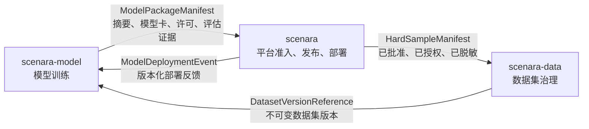

# Scenara 仓库拓扑

适用版本：`0.3.0-dev.12`。本文定义 Scenara 产品矩阵的代码仓库边界、跨仓库契约和拆分门禁。

## 决策

当前 `scenara` 仓库继续作为平台集成仓库，不改名为 `scenara-parse`。它承载 Scenara Parse、Console、API、SDK、Index 以及未来 Search、Flow、Edge、Agent 的共享平台能力，同时保留 Model 与 Data 的平台侧集成和治理入口。

已有模型训练仓库作为 Scenara Model 的专业仓库，专注训练作业、实验跟踪、训练算力调度、训练评估和不可变模型制品生成。本文使用逻辑仓库标识 `scenara-model`；实际远程仓库地址由组织级仓库配置绑定，不写死在平台契约中。

Scenara Data 规划为专业仓库，但当前不创建空壳仓库。只有数据集、版本、标注审核、质量、血缘、授权和导出形成稳定的一等资源与负责人后，才建立逻辑标识为 `scenara-data` 的独立仓库。

## 职责拓扑

| 仓库 | 生命周期 | 负责 | 明确不负责 |
| --- | --- | --- | --- |
| `scenara` | 当前平台集成仓库 | Parse、Console、API、SDK、平台运行时、媒体与运行、流水线、共享 IAM/授权/审计、产品目录、模型准入/发布/部署、业务反馈与难例导出 | 模型训练作业、实验跟踪、训练算力调度、完整数据集治理 |
| `scenara-model` | 已有独立专业仓库 | 训练作业、实验、训练算力、训练评估、不可变模型制品 | 共享 IAM、共享 Console/API/SDK、运行时模型激活/回滚、部署审计 |
| `scenara-data` | 规划中的独立专业仓库 | 数据集目录与版本、标注审核、质量、血缘、授权与导出 | 业务媒体/运行/结果存储、模型训练编排、共享 IAM |

Model 和 Data 在产品目录中仍是 Scenara 产品，不因代码拆仓而复制平台入口。Console、API、SDK、身份、权限、审计、租户和项目上下文始终由 `scenara` 共享提供。

## 集成契约

| 契约 | 版本 | 生产方 | 消费方 | 传输方式 | 核心约束 |
| --- | --- | --- | --- | --- | --- |
| `model-package-admission` | `1.0.0` | `scenara-model` | `scenara` | 不可变清单 | SHA-256、模型卡、许可元数据、评估证据、运行时绑定和不可变制品引用齐全 |
| `deployment-feedback` | `1.0.0` | `scenara` | `scenara-model` | 事件 / 签名 Webhook | 版本化结构、租户/项目作用域、运行时版本和审计轨迹齐全 |
| `hard-sample-handoff` | `1.0.0` | `scenara` | `scenara-data` | 不可变清单 | 仅包含已批准反馈，并通过导出授权、脱敏和内容摘要检查 |
| `dataset-version-input` | `1.0.0` | `scenara-data` | `scenara-model` | 版本化接口 | 数据集版本不可变，血缘和访问授权齐全 |

当前平台通过 `POST /api/v1/model-packages/admissions` 接收正式 `ModelPackageManifest`。清单必须把模型制品、模型卡和评估证据绑定到 SHA-256，并声明平台已安装配置中的 `runtime_model_id`。发布经过 `candidate -> validated -> approved -> active -> retired`；激活与回滚按租户、项目和能力维护唯一绑定。Run 开始时冻结绑定，避免在途执行被后续切换改变，并把模型标识、版本和摘要写入 Result 来源。

每次发布状态变化都会生成 `ModelDeploymentEvent`。除可按租户/项目读取事件列表外，训练仓库可订阅 `model.deployment.changed` Webhook；事件进入平台 Outbox，复用签名、重试和死信机制，投递结果可从 Webhook Delivery 查询。独立仓库不得绕过平台直接修改运行数据库或发布状态。

## 强制边界

- 跨仓库只能使用版本化 API、事件或不可变清单，禁止依赖未版本化的内部结构。
- 禁止共享数据库表。每个专业仓库拥有自己的持久化边界，通过标识、版本和摘要引用外部资源。
- 禁止跨仓库源码导入。可复用契约必须进入版本化 SDK、生成类型或独立契约包。
- 模型制品、数据集版本和难例清单必须使用不可变引用和内容摘要。
- 专业仓库不复制租户、项目、身份、权限、审计、Console、API 网关或 SDK 发布体系。

## Data 拆分门禁

创建 `scenara-data` 前必须同时满足：

1. 数据集、数据集版本和血缘成为稳定的一等资源，并有不可变标识。
2. 标注、复核、质量、授权、脱敏和导出具有明确的服务边界与负责人。
3. `HardSampleManifest` 输入和 `DatasetVersionReference` 输出完成版本化契约与兼容性测试。
4. Data 有独立发布节奏、容量模型、备份恢复和安全责任，拆分收益高于跨仓库运维成本。

未满足门禁时，业务媒体、运行结果、反馈和难例导出继续留在 `scenara`，不以目录搬迁冒充数据平台建设。

## 可执行契约

仓库拓扑通过 `GET /api/v1/platform/repositories` 暴露，当前结构版本为 `1.0`。Python SDK 使用 `get_repository_topology()`，TypeScript SDK 使用 `getRepositoryTopology()`。Console 总览从该接口读取拓扑，但所有面向用户的职责和状态均通过中文标签层展示。

四条正式契约发布在 `contracts/repository/v1.0.0/`，采用 JSON Schema Draft 2020-12。每条契约包含 Schema、有效示例与 SHA-256；`manifest.json` 描述生产方、消费方、传输方式和兼容策略，`release-index.json` 锁定已发布清单摘要。`GET /api/v1/platform/contracts` 返回契约目录，`GET /api/v1/platform/contracts/{contract_id}/schema` 返回具体 Schema。Python/TypeScript SDK 分别使用 `get_repository_contracts()` 与 `getRepositoryContracts()` 查询。

CI 执行 `python scripts/repository_contracts.py --check`，验证 Pydantic 模型、Schema、示例、摘要和发布索引零漂移，并生成确定性的 `repository-contracts-1.0.0.zip` 制品。候选版本通过 `--against` 对上一发布版本运行消费方兼容检查；新增必填字段、删除字段、收窄枚举/联合类型、收窄类型或强化字符串、数值和数组约束都会失败。具体命令见 [`contracts/repository/README.md`](../../contracts/repository/README.md)。

该接口是仓库规划的机器可读事实来源；本文件解释其架构意图。修改仓库归属时，必须同时更新拓扑构建器、OpenAPI、两个 SDK、Console、契约测试和发布日志。
